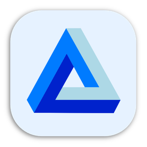
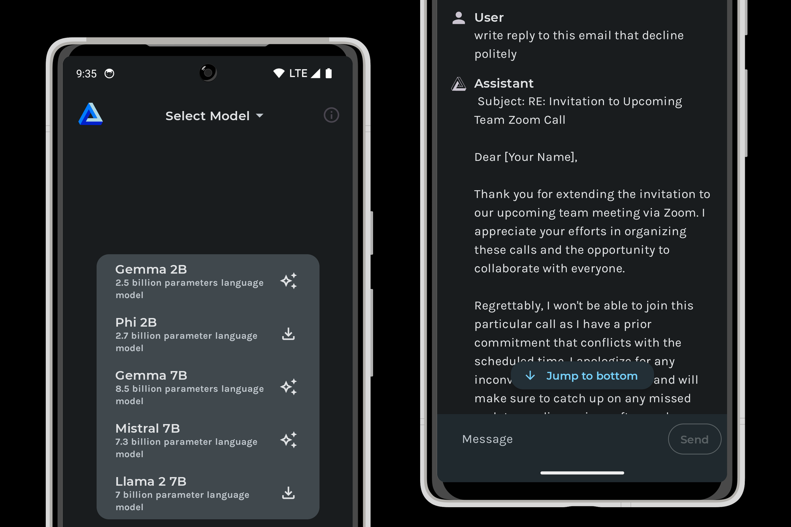

<h1 align="center">LM Playground</h1>

<p align="center">

</p>

LM Playground is an Android application for running Large Language Models locally on-device. Download models, load them in one tap, and chat - all offline, all private. Powered by [llama.cpp](https://github.com/ggml-org/llama.cpp) with GGUF-format models from [Hugging Face](https://huggingface.co/).



## Features

- **On-device inference** - no cloud, no API keys, fully offline
- **Rich markdown** in chat responses - headers, code blocks, lists, and more
- **Reasoning model support** - thinking steps from models like DeepSeek R1 and Nemotron are displayed in a styled section
- **Reliable background downloads** - custom download engine with OkHttp and WorkManager, progress notifications with speed and ETA, automatic resume on network interruptions
- **Storage management** - choose where to keep multi-GB model files with Android's Storage Access Framework
- **ARM optimized** - KleidiAI kernels and OpenMP for faster generation on arm64 devices

## Supported Models

| Family | Sizes | Provider |
|--------|-------|----------|
| Qwen 3.5 | 0.8B, 2B, 4B | Alibaba |
| Qwen 3 | 0.6B, 1.7B, 4B | Alibaba |
| Gemma 3n | E2B, E4B | Google |
| Gemma 3 | 1B, 4B | Google |
| Nemotron 3 Nano | 4B | NVIDIA |
| Granite 4.0 | Micro, H-Tiny | IBM |
| DeepSeek R1 Distill | 1.5B, 7B | DeepSeek |
| Phi-4 mini | 3.8B | Microsoft |
| LFM2.5 Thinking | 1.2B | Liquid AI |
| Ministral 3 | 3B, 8B (Instruct & Reasoning) | Mistral |
| Llama 3.2 | 1B, 3B | Meta |
| Llama 3.1 | 8B | Meta |

<details>
<summary>Legacy models</summary>

| Family | Sizes | Provider |
|--------|-------|----------|
| Qwen 2.5 | 0.5B, 1.5B | Alibaba |
| Phi 3.5 mini | 3.8B | Microsoft |
| Mistral v0.3 | 7B | Mistral |
| Gemma 2 | 9B | Google |

</details>

Most models use Q4_K_M quantization; Qwen 3.5 uses Q3_K_M. See [`ModelInfoProvider.kt`](app/src/main/java/com/druk/lmplayground/models/ModelInfoProvider.kt) for the full list.

## Install

If you're just looking to install LM Playground, you can find it on [Google Play](https://play.google.com/store/apps/details?id=com.druk.lmplayground). If you're a developer wanting to contribute, read on.

## Build Instructions

Prerequisites:
* Android Studio [2024.3.1+](https://developer.android.com/studio/releases)
* NDK 27.2.12479018
* CMake 3.31.6

1. Clone the repository with submodules:
```
git clone --recurse-submodules https://github.com/andriydruk/LMPlayground.git
```
2. Open the project in Android Studio: `File` > `Open` > Select the cloned repository.
3. Connect an Android device or start an emulator.
4. Run the application using `Run` > `Run 'app'` or the play button in Android Studio.

## License

This project is licensed under the [MIT License](LICENSE).

## Acknowledgments

This project is built on [llama.cpp](https://github.com/ggml-org/llama.cpp). Models are GGUF-format with Q4_K_M quantization sourced from [Hugging Face](https://huggingface.co/).

## Contact

If you have any questions, suggestions, or issues, feel free to open an issue or contact me directly at [me@andriydruk.com](mailto:me@andriydruk.com).
